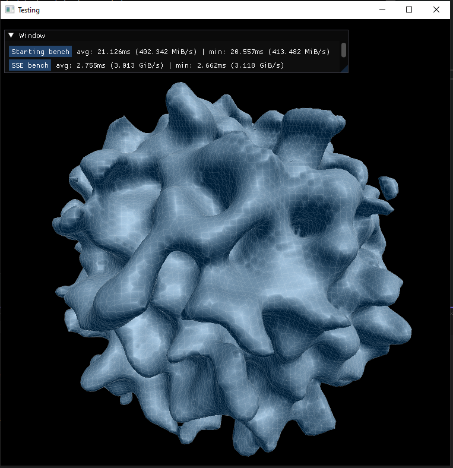
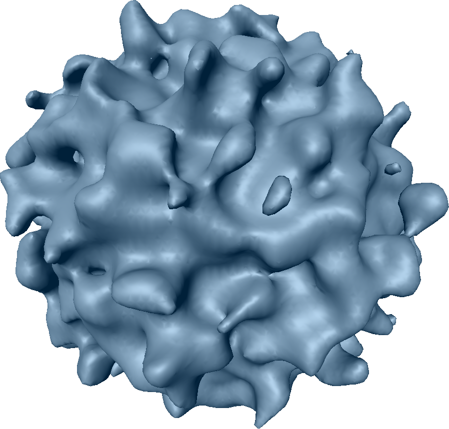

# Optimized SDF -> Triangle list

* 128^3^
* SSE4.1 intrinsics
* Auxiliary bitfields for fast skipping of empty or solid areas

# Tests

Version|Speed
-|-
Initial|~400 mb/s
Optimized|~3 gb/s

# Ways of SIMDifying vertex generation
To determine vertex position we need to look at 12 edges of a cube, 4 for each coordinate.
Methods 1 and 2 work on a single vertex, 3 on multiple.
## 1. Horizontal
Do each axis separately.
For each axis:
* unlerp (find where the zero is) distance differences on four edges that go along that axis.
* discard result if there is no surface (by `&`ing with a sign difference mask)
* sum results. because all 4 values are in one register we have to use horizontal sum. There is no such instuction in SSE, but we can use a dot product instruction `dpps` with all ones.
## 2. Vertical
Work on all axes at once. Because there are 3 axes and registers have 4 floats, one float in the register is not used.

Advantage of this is not having to use horizontal operations, which are slower than vertical (I measured that 4 `dpps` is two times slower than 4 `mulps` and 3 `addps`).
But the problem is that the distances have to be shuffled a lot more (15 more shuffles and two 4x4 transposes). It's because we have 8 distances to work with, so 2 xmm registers, but
## 3. Store relevant distances in a buffer to process later, generating 4 at once.
When found a surface, don't generate a vertex immediately. Put the data required to build it into an SOA (Struct Of Arrays) buffer. When if fills up, generate all 4 vertices at once. This is most scalable method, but it requires a lot of registers (a lot more than 16 available on cpus with SSE or AVX) to work on that amount of vertices, while previous two work perfectly without spilling to the stack.

# Ways of producing Normals
## 1. Generate only positions, calculate normals from triangles

This is a "standard" way of calculating normals for a triangle mesh.
After generating positions and triangles, you loop over the triangles, add the normal of the triangle to the vertices' normals.
Then in another loop you normalize the normals, averaging them.
It does look good, but requires processing after generating triangles.
## 2. Calculate from sdf differences when generating a vertex

When generating a vertex, you can look at differences of distances on each axis and calculate the normal vector from that.
They are calculated significantly faster than from triangles (1.5x) - you do just a little extra work per vertex and don't have to loop over them again.
But it looks significantly worse. Normal is calculated as if it was at the center of the cell, but the position is shifted to make the mesh smoother.
That creates areas where normals are stretched or shrinked way too much, making it look blocky and noisy.

## 3. Calculate from sdf differences in the shader

The third approach is the most expensive one, the most accurate and it looks the best.
It requires sending _the entire 3d array_ of distances to the GPU, doing _27 fetches_ from that array _per pixel_, then doing a ton of additions to calculate normals of 8 cells, then blending between them.

I don't know if I calculated this correctly, but GPU performance is 2.5x worse than in both previous methods.

.|.
-|-
per vertex normals | 3400 fps at 40% usage
per pixel normals | 2650 fps at 80% usage